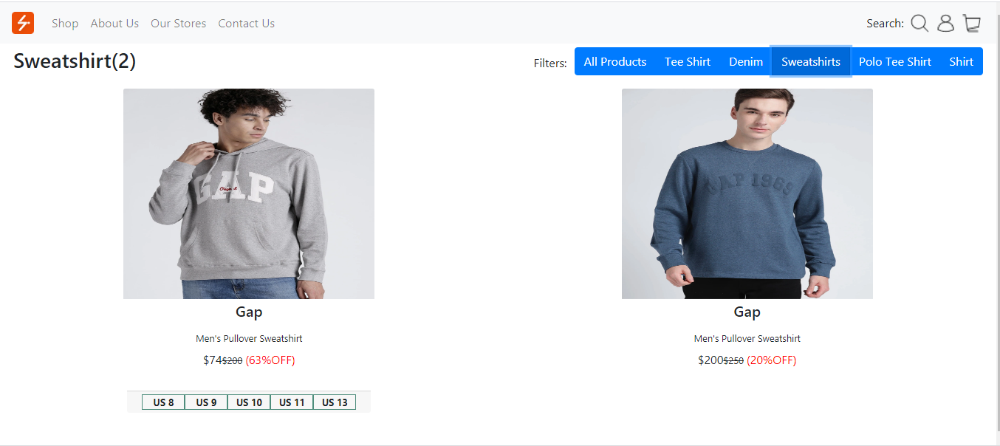
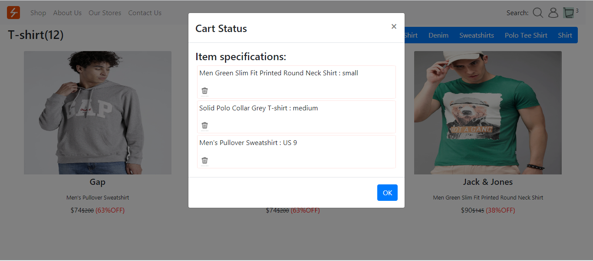

# About the project #
I have created this app as a Proof of Concept.The app has a single page that lists products from a JSON sent by an API. 

This application is published at  https://Surbhi-Kohli.github.io/shopTradeEcommerceApp/

# Images

# Features #
* Lists all the products on the page.
* On hovering on products ,available options for the product are shown.
* Each product's options are clickable.
* Once an option for a product is clicked; a popup appears ,that shows the      selected product(along with the option chosen)  and has an "Add to Cart" button
* Cart displays product quantity as well as lists each chosen product(as well as the option)
* The products currently in the cart can be removed.
* Products in the page can be filtered by choosing the available filters.
* The application is responsive(flex-box has been used).

# Getting Started with Create React App

This project was bootstrapped with [Create React App](https://github.com/facebook/create-react-app).

## Available Scripts

In the project directory, first install node modules by running:
 ### `npm install`

 After the successful installation ,run the following command.

### `npm start`

Runs the app in the development mode.\
Open [http://localhost:3000](http://localhost:3000) to view it in the browser.

The page will reload if you make edits.\
You will also see any lint errors in the console.

### `npm test`

Launches the test runner in the interactive watch mode.\
See the section about [running tests](https://facebook.github.io/create-react-app/docs/running-tests) for more information.

### `npm run build`

Builds the app for production to the `build` folder.\
It correctly bundles React in production mode and optimizes the build for the best performance.

The build is minified and the filenames include the hashes.\
Your app is ready to be deployed!

See the section about [deployment](https://facebook.github.io/create-react-app/docs/deployment) for more information.

### `npm run eject`

**Note: this is a one-way operation. Once you `eject`, you can’t go back!**

If you aren’t satisfied with the build tool and configuration choices, you can `eject` at any time. This command will remove the single build dependency from your project.

Instead, it will copy all the configuration files and the transitive dependencies (webpack, Babel, ESLint, etc) right into your project so you have full control over them. All of the commands except `eject` will still work, but they will point to the copied scripts so you can tweak them. At this point you’re on your own.

You don’t have to ever use `eject`. The curated feature set is suitable for small and middle deployments, and you shouldn’t feel obligated to use this feature. However we understand that this tool wouldn’t be useful if you couldn’t customize it when you are ready for it.

